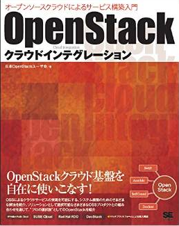

クラウドインテグレーション体験ラウンジ
================

- ようこそ「クラウドインテグレーション体験ラウンジ」へ！
- このラウンジではOpenStack上にシステムをインテグレーションするための技術について、考え方と具体的な操作方法と合わせて体験できます。
- 本ラウンジは、セルフサービス型のハンズオン形式になっています。
- 続くページのリンクから、体験してみたいテーマを選択してください！
- 最後にアンケートがありますので、体験後に是非回答をお願いします。次回以降の参考とさせていただきます。

----

注意事項
================

- 混雑時に本環境を長時間占有するのはご遠慮ください。
- 本環境でプライベートなインターネットアクセスはご遠慮ください。
- 本環境は、OpenStack Days 2015 開催日のみアクセス可能な環境になります。

----

環境へのログイン方法１
================

- 端末でのログイン方法

  - ノートPCで端末ソフト Mitty を起動して、student *XX* ユーザーでログインします。

  - *XX* 部分は、操作しているノートPCの番号になります。

ログイン後の状態::

  ---------ここから---------
  $ ssh studentXX

  [studentXX@osdt-lounge-console-vm ~]$
  ---------ここまで---------

ログインした先の *XX* がノートPCの番号と確認してください。

----

環境へのログイン方法2
================

- Horizonへのログイン方法

  - ログインIDを確認するには、以下のコマンドを実行します。

スクリプトの実行::

  ---------ここから---------
  $ check_id
  ---------ここまで---------

----

以下からテーマを選択してください。
================

- `1. 基礎操作編 <./index01.html>`_
- `2. クラウド上の自動化 <./index02.html>`_
- `3. クラウド上のデータ保護 <./index03.html>`_
- `4. システムデザイン <./index04.html>`_

- `OpenStack環境について <./about_env.html>`_

- `アンケート <https://docs.google.com/forms/d/13bzoJcSk8I80E70-52UPkfaEN5Ye4iLw1SMG1fPsLl0/viewform?usp=send_form>`_ (演習の最後にお願いします)

- ヘルプ

  - 「t」「h」キーで、スライドの目次、操作方法を表示できます。
  - 操作方法でわからないことがあれば、お近くのスタッフまでお声がけください。

----

本演習について
================

- 本演習は、翔泳社「OpenStackクラウドインテグレーション オープンソースクラウドによるサービス構築入門」から抜粋しております。
- 体験した内容をより深く学習したい方は、こちらをご参照ください。
- http://www.amazon.co.jp/dp/4798139785

----

よくあるエラーと対処
================

- `エラーと対処まとめ <./error.html>`_
