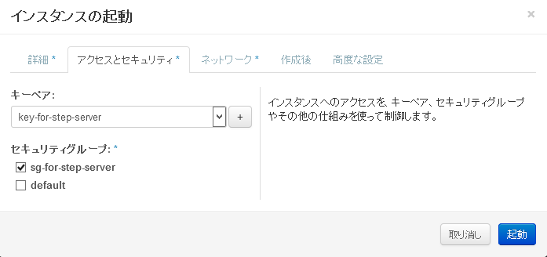
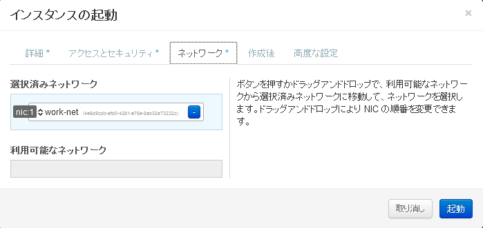

仮想サーバーを1台起動してみる(CLI)
================

----

概要
================

- ここではOpenStack上にコマンドラインを利用して仮想サーバーを１台起動します。

----

状態の確認
================

- まず、Horizonへログインし、現在の状況を確認します。
- http://www.rdcloud.bi-rd.net/auth/login/
- ログインIDの確認方法は次ページ参照

.. image:: ./_assets/c1-t1/01_login.png
   :width: 40%

----

ログインIDの確認
================

- ログインIDを確認するには、以下のコマンドを実行します。

スクリプトの実行::

  ---------ここから---------
  $ check_id
  ---------ここまで---------

----

ログイン後の画面
================

- この画面では全体の概要を確認できます。

.. image:: ./_assets/c1-t1/02_overview.png
   :width: 100%

----

状態の確認
================

- 「ネットワークの管理」→「ネットワークトポロジー」を選択します。

.. image:: ./_assets/c1-t1/03_networks.png
   :width: 80%

----

環境の解説
================

- ここでは、2つのネットワークと1つの仮想ルーターが確認できます。

  - Ext-Net

    - インターネットへ接した外部ネットワーク

  - work-net

    - OpenStack上に作られた仮想ネットワーク

      - ここに仮想マシンを接続します

  - Ext-Router

    - 二つのネットワークを接続する仮想ルーター

----

仮想マシンの起動
================

- 仮想マシンを起動します。
- 「コンピュートの管理」→ 「インスタンス」→「インスタンスの起動」を選択します。

.. image:: ./1_assets/c1-t1/04_instance_01.png
   :width: 80%

----

仮想マシンの起動
================

- 「詳細」にパラメータを指定します（事項参照）

.. image:: ./_assets/c1-t1/04_instance_02.png
   :width: 65%

----

仮想マシンの起動
================

- 指定パラメータ

  - アベイラビリティゾーン： az1

  - インスタンス名： student *XX* -server

    - *XX* の部分は、操作しているノートPCの番号を入力してい下さい。

  - フレーバー： standard.xsmall

  - インスタンス数： 1

  - インスタンスのブートソース： イメージから起動

  - イメージ名： centos-base

----

仮想マシンの起動
================

- セキュリティグループとキーペアを指定します
- 両方とも「default」を指定します。

----

仮想マシンの起動
================

- 所属するネットワークを選択します。
- 「work-net」を選択します。
- ここまでの入力が終了したら、「起動」を選択します。

----

仮想マシンの起動
================

- この操作で仮想マシンが起動できます。
- リストに表示された仮想マシンのメニューから、「ログの確認」を行い起動状態を確認してみてください。

- この演習では実際に起動した仮想マシンへのログインは行いません。

  - 簡単な自動化のパートでログインまで行います。

----

後かたずけ
================

- 起動した仮想マシンを削除します。
- 「コンピュートの管理」→ 「インスタンス」を選択します。
- 起動したインスタンスを選択し、「インスタンスの終了」を選択してください。

  - 「終了」となっていますが、「停止」ではなく「削除」されます。

----

ポイントとまとめ
================

- OpenStackでは仮想マシンを起動する際に、「イメージ」と「フレーバー」を選択します。

  - フレーバーは管理者しか用意することができません。
  - 起動する場合に、詳細なスペックを与えることはできません。これは環境の標準化という側面もあります。

- 起動時には任意の仮想ネットワークへ接続することができます。

- 起動した仮想マシンは即座に削除できます。これはOpenStackが仮想マシンを「一時的なリソース」として取り扱うためです。

  - この考えに即したシステムデザインを行うことで、効率的な運用が可能となります。

