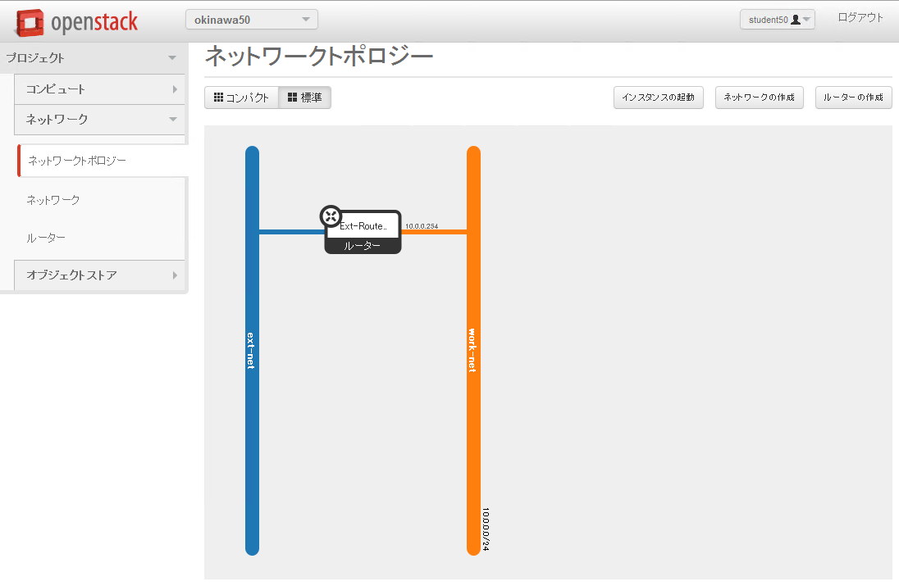

仮想サーバーを1台起動してみる(CLI)
================

----

概要
================

- ここではOpenStack上にコマンドラインを利用して仮想サーバーを１台起動します。
- ダッシュボードを利用した仮想サーバーの起動と比較するとわかりやすいと思います。

----

状態の確認
================

- まず、Horizonへログインし、現在の状況を確認します。
- http://www.rdcloud.bi-rd.net/auth/login/
- ログインIDの確認方法は次ページ参照

.. image:: ./_assets/t1-c2/01_login.png
   :width: 40%

----

ログインIDの確認
================

- ログインIDを確認するには、以下のコマンドを実行します。

スクリプトの実行::

  ---------ここから---------
  $ check_id
  ---------ここまで---------

----

ログイン後の画面
================

- この画面では全体の概要を確認できます。

.. image:: ./_assets/c1-c2/02_overview.png
   :width: 100%

----

状態の確認
================

- 「ネットワークの管理」→「ネットワークトポロジー」を選択します。

----

環境の解説
================

- ここでは、2つのネットワークと1つの仮想ルーターが確認できます。

  - Ext-Net

    - インターネットへ接した外部ネットワーク

  - work-net

    - OpenStack上に作られた仮想ネットワーク

      - ここに仮想マシンを接続します

  - Ext-Router

    - 二つのネットワークを接続する仮想ルーター

----

操作環境へのログイン
================

- コマンドラインを利用してサーバーを起動していきます。
- まずは端末を開き、student *XX* で操作環境へログインします。

コマンドの実行::

  ---------ここから---------
  $ ssh studentXX
  ---------ここまで---------

*XX* の部分は、操作しているPCに割り当てられているノートPCの番号になります。

----

仮想サーバーの起動
================

- 以下のコマンドを実行して、仮想サーバーを起動します。

コマンドの実行::

  ---------ここから---------
  $ function get_uuid () { cat - | grep " id " | awk '{print $4}'; }
  $ export MY_WORK_NET=`neutron net-show work-net | get_uuid`

  $ nova boot --flavor standard.xsmall --image "centos-base" \
  --key-name default --security-groups default \
  --availability-zone az1 \
  --nic net-id=${MY_WORK_NET} studentXX-vm-from-cli
  ---------ここまで---------

*XX* の部分は、操作しているPCに割り当てられているノートPCの番号になります。

----

仮想サーバーの起動状態の確認
================

- Horizonからネットワークトポロジーを確認してみてください。
- 合わせて、以下のコマンドを実行し、仮想サーバーの起動状態を確認します。

コマンドの実行::

  ---------ここから---------
  $ nova list
  $ watch -n 10 nova console-log --length 20 studentXX-vm-from-cli
  ---------ここまで---------

*XX* の部分は、操作しているPCに割り当てられているノートPCの番号になります。

終了するには *Ctrl-c* になります。

- ログインプロンプトが表示されたら次の操作に移ります。

----

稼働サーバーへのログイン
================

- 仮想サーバーへ外部からアクセス可能なIPを割り当てて、SSHでログインしてみます。

コマンドの実行::

  ---------ここから---------
  $ nova floating-ip-create Ext-Net
  +--------------+-----------+----------+---------+
  | Ip           | Server Id | Fixed Ip | Pool    |
  +--------------+-----------+----------+---------+
  | 118.67.96.YY |           | -        | Ext-Net |
  +--------------+-----------+----------+---------+

  $ nova floating-ip-associate studentXX-vm-from-cli 118.67.96.YY
  ---------ここまで---------

*XX* の部分は、操作しているPCに割り当てられているノートPCの番号になります。
*118.67.96.YY* の部分は、実際に表示される値に読み替えてください。

----

稼働サーバーへのログイン
================

- 今回利用した *default* キーペアは、既にログインした *studentXX* 環境に秘密鍵が保存してあるので、そちらを利用して仮想サーバーへログインしてみます。

コマンドの実行::

  ---------ここから---------
  $ cd $HOME
  $ ssh -i default.pem root@118.67.96.YY
  ---------ここまで---------

*118.67.96.YY* の部分は、実際に表示される値に読み替えてください。

----

後かたずけ
================

- 起動した仮想マシンを削除します。

コマンドの実行::

  ---------ここから---------
  $ nova delete studentXX-vm-from-cli
  $ nova floating-ip-delete 118.67.96.YY
  ---------ここまで---------

----

後かたずけ
================

- 削除後、以下のようにリソースが削除されていることを確認します。

コマンドの実行::

  ---------ここから---------
  $ nova list
  +----+------+--------+------------+-------------+----------+
  | ID | Name | Status | Task State | Power State | Networks |
  +----+------+--------+------------+-------------+----------+
  +----+------+--------+------------+-------------+----------+

  $ nova floating-ip-list
  +----+-----------+----------+------+
  | Ip | Server Id | Fixed Ip | Pool |
  +----+-----------+----------+------+
  +----+-----------+----------+------+
  ---------ここまで---------

----

ポイントとまとめ
================

- OpenStackでは仮想マシンを起動する際に、「イメージ」と「フレーバー」を選択します。

  - フレーバーは管理者しか用意することができません。
  - 起動する場合に、詳細なスペックを与えることはできません。これは環境の標準化という側面もあります。

- 起動時には任意の仮想ネットワークへ接続することができます。

- 起動した仮想マシンは即座に削除できます。これはOpenStackが仮想マシンを「一時的なリソース」として取り扱うためです。

  - この考えに即したシステムデザインを行うことで、効率的な運用が可能となります。

