仮想ネットワークを構成してみる
================

----

概要
================

- ここではOpenStack上に仮想ネットワークを構成します。
- OpenStackではテナント内で独立したネットワーク環境を自由に構成できます。

----

状態の確認
================

- まず、Horizonへログインし、現在の状況を確認します。
- http://www.rdcloud.bi-rd.net/auth/login/
- ログインIDの確認方法は次ページ参照

.. image:: ./_assets/t1-c3/01_login.png
   :width: 40%

----

ログインIDの確認
================

- ログインIDを確認するには、以下のコマンドを実行します。

スクリプトの実行::

  ---------ここから---------
  $ check_id
  ---------ここまで---------

----

ログイン後の画面
================

- この画面では全体の概要を確認できます。

.. image:: ./_assets/t1-c3/02_overview.png
   :width: 100%

----

状態の確認
================

- 「ネットワークの管理」→「ネットワークトポロジー」を選択します。

.. image:: ./_assets/t1-c3/03_networks.png
   :width: 80%

----

環境の解説
================

- ここでは、2つのネットワークと1つの仮想ルーターが確認できます。

  - Ext-Net

    - インターネットへ接した外部ネットワーク

  - work-net

    - OpenStack上に作られた仮想ネットワーク

      - ここに仮想マシンを接続します

  - Ext-Router

    - 二つのネットワークを接続する仮想ルーター

----

作業の内容
================

- これから以下の環境をOpenStack上に構築してみます。

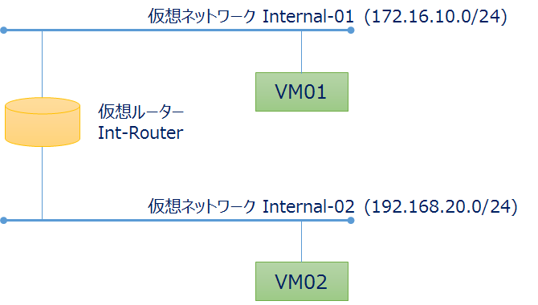

二つの仮想ネットワークを作成し、仮想ルーターで接続します。それぞれのネットワークにVMを2台作成し、お互いに疎通を確認します。

----

仮想ネットワークの作成
================

- Horizonから操作を行っていきます。

  - 「ネットワークの管理」→「ネットワーク」→「ネットワークの作成」を選択します。
  - 「internal01」ネットワークを作成します。

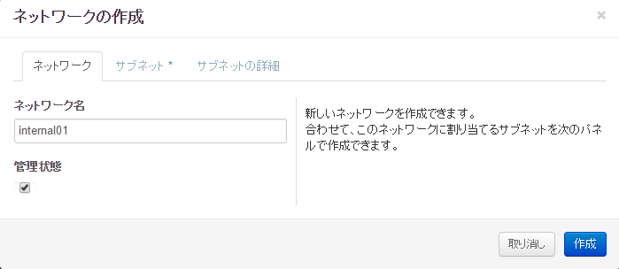

----

仮想ネットワークの作成
================

- ネットワークアドレス「172.16.10.0/24」でネットワークを作成します。
- 入力したら「作成」を選択します。

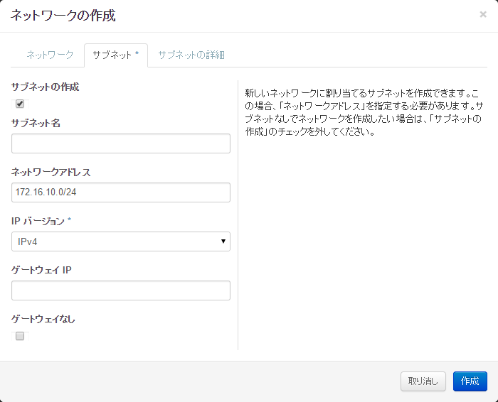

----

仮想ネットワークの作成
================

- 先の手順と同様に2つ目の仮想ネットワークを作成します。

  - ネットワーク名「internal02」
  - ネットワークアドレス「192.168.20.0/24」

----

仮想ネットワークの作成
================

- 2つのネットワーク作成が完了すると、以下の状態となります。

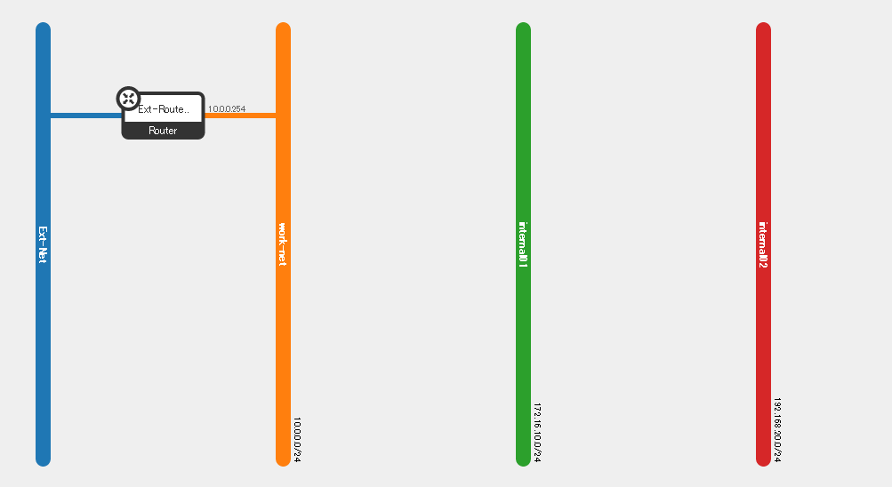

----

仮想ルーターの作成
================

- 次に仮想ルーターを作成していきます。

  - 「ネットワークの管理」→「ルーター」→「ルーターの作成」を選択します。
  - ルーター名に「Int-Router」を選択します。

.. image:: ./_assets/t1-c3/05-router-01.png
   :width: 80%

----

仮想ルーターとネットワークの接続
================

- 作成したルーターを選択します。
- ルーターの詳細画面で、「インターフェースの追加」を選択します。

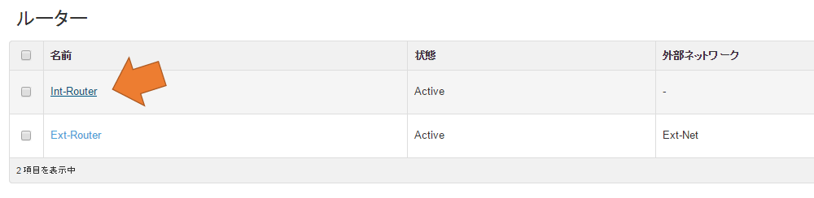

----

仮想ルーターとネットワークの接続
================

- サブネット「internal01」を選択して、「インターフェースの追加」を押下します。

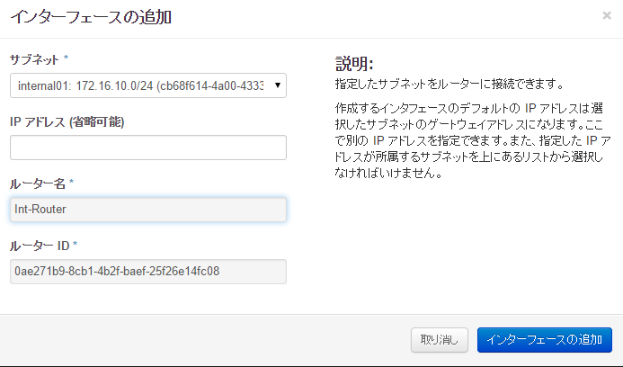

----

仮想ルーターとネットワークの接続
================

- 同様に、インターフェースの追加を行い「internal02」を追加します。

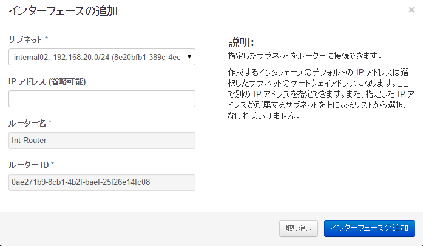

----

仮想ルーターとネットワークの接続
================

- この時点で、以下のようなネットワークトポロジーになっているはずです。

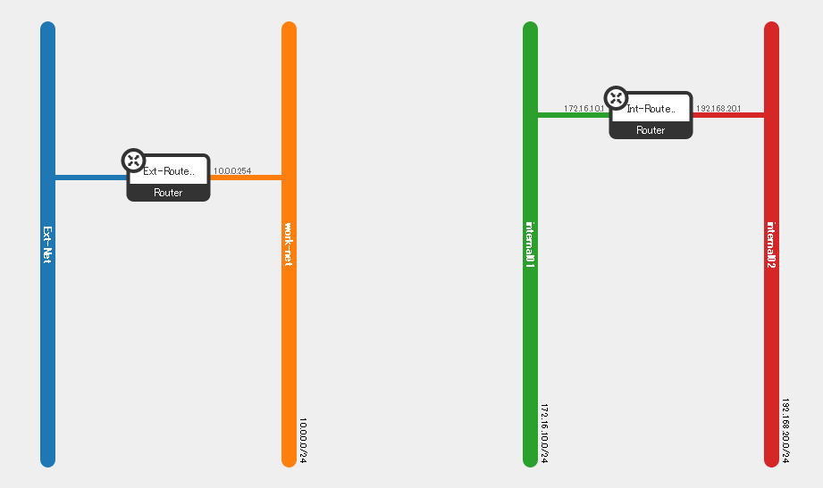

----

仮想マシンの起動
================

- 作成したネットワークに接続する仮想マシンを作成していきます。
  - 「コンピュートの管理」→「インスタンス」→「インスタンスの作成」を選択します。

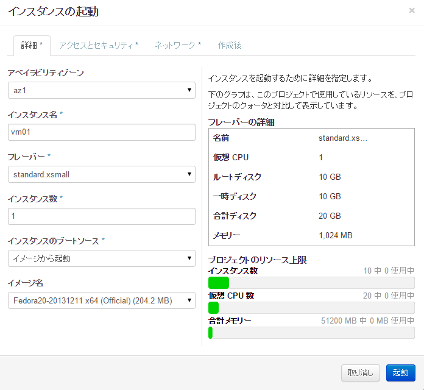

次項のパラメータで仮想マシンを作成します。

----

仮想マシンの起動
================

- 指定パラメータ

  - アベイラビリティゾーン： az1

  - インスタンス名： vm01

  - フレーバー： standard.xsmall

  - インスタンス数： 1

  - インスタンスのブートソース： イメージから起動

  - イメージ名： Fedora20

----

仮想マシンの起動
================

- セキュリティグループとキーペアを指定します
  - キーペア「default」
  - 管理者パスワード「password」
  - セキュリティグループ「default」

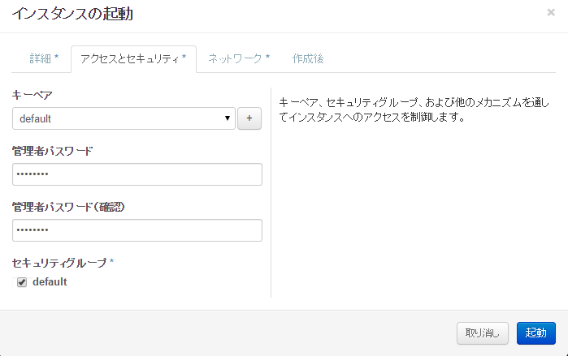

----

仮想マシンの起動
================

- 所属するネットワークを選択します。
  - 「internal01」を選択します。
  - ここまでの入力が終了したら、「起動」を選択します。

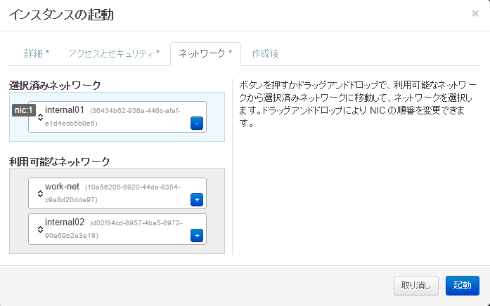

----

仮想マシンの起動
================

- 同様に2台のVMを作成します。

  - 名前「vm02」
  - ネットワーク「internal02」

- その他は先のvm01と同様。

----

仮想マシンの起動
================

- 仮想マシンが作成されると、以下の状態になります。

.. image:: ./_assets/t1-c3/06-instance-04.png
   :width: 80%

----

接続の確認
================

- 作成した仮想マシンの一覧から、仮想マシンのIPアドレスをメモしておきます。
- 次に、どちらでもよいので仮想マシンのメニューを開き、「コンソール」を選択します。

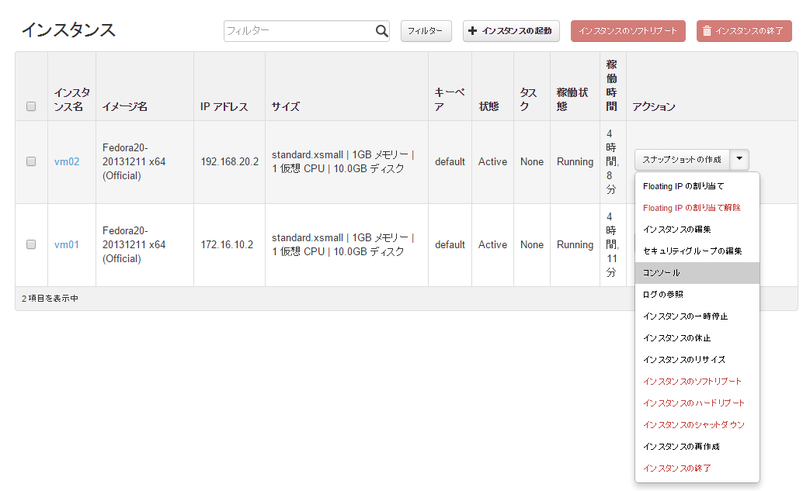

----

接続の確認
================

- コンソールを開いたマシンへログインします。

  - キーを仮想マシンへ送るには、「Connected (unencrypted) to: QEMU (instance-00000aa1)」バーをクリックしてください。

    - 表示されているコンソールのすぐ上に表示されています。

- ログインは root 、入力したパスワードです。

  - ログインした仮想マシンから、もう一台の仮想マシンへ ping を打ってみてください。

----

後かたずけ
================

- 以下を実行します。

コマンド実行::

  $ /opt/support/t1-c3/9_cleanup.sh

----

ポイントとまとめ
================

- OpenStack上には、テナントごとに完全独立したネットワークを構成できます。

- アドレスの重複といった問題を意識する必要がありません。

  - テナント内においては気にする必要があるので注意してください（ルーティングの問題）

- 演習に使っているOpenStack環境は、他の演習ユーザと共有していますが、他の演習で構成されるネットワークの影響を受けていないことを確認できると思います。
