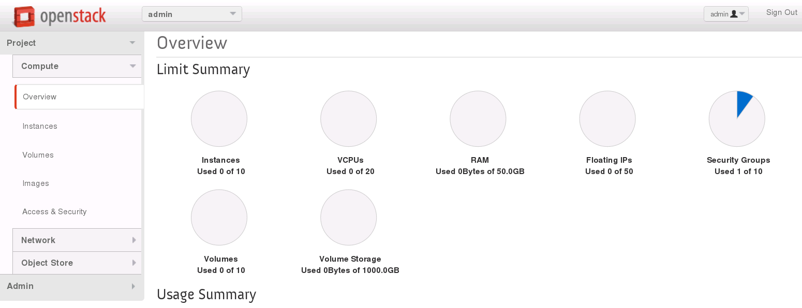

簡単なサーバー自動構築にチャレンジしてみる
================

----

概要
================

- ここではOpenStack上にコマンドラインを利用してサンプルアプリケーションの自動構築にチャレンジしてみます。
- サンプルアプリケーションはシンプルな掲示板アプリになります。

----

状態の確認
================

- まず、Horizonへログインし、現在の状況を確認します。
- http://www.rdcloud.bi-rd.net/auth/login/
- ログインIDの確認方法は次ページ参照

.. image:: ./_assets/t1-c2/01_login.png
   :width: 40%

----

ログインIDの確認
================

- ログインIDを確認するには、以下のコマンドを実行します。

スクリプトの実行::

  ---------ここから---------
  $ check_id
  ---------ここまで---------

----

ログイン後の画面
================

- この画面では全体の概要を確認できます。

----

状態の確認
================

- 「ネットワークの管理」→「ネットワークトポロジー」を選択します。

.. image:: ./_assets/t1-c2/03_networks.png
   :width: 80%

----

環境の解説
================

- ここでは、2つのネットワークと1つの仮想ルーターが確認できます。

  - Ext-Net

    - インターネットへ接した外部ネットワーク

  - work-net

    - OpenStack上に作られた仮想ネットワーク

      - ここに仮想マシンを接続します

  - Ext-Router

    - 二つのネットワークを接続する仮想ルーター

----

操作環境へのログイン
================

- コマンドラインを利用してサーバーを起動していきます。
- まずは端末を開き、student *XX* で操作環境へログインします。

コマンドの実行::

  ---------ここから---------
  $ ssh studentXX
  ---------ここまで---------

*XX* の部分は、操作しているPCに割り当てられているノートPCの番号になります。

----

自動化の概要
================

- 自動化には *userdata* という仕組みを利用します。
- これは、起動する仮想マシンに外部からスクリプトを送り込み実行させる仕組みです。
- このスクリプトを外部に持つことで、何度でも同じ設定を持った仮想マシンを作成できるようになります。

----

userdata の作成
================

- 操作環境へ *studentXX* でログインし、以下のファイルを作成します。

コマンドの実行::

  ---------ここから---------
  $ cd $HOME
  $ vi userdata_t1-c4.txt
  ---------ここまで---------

ファイルの内容は事項参照

----

userdata の中身
================

userdata::

  ---------ここから---------
  #!/bin/bash
  yum install -q -y git
  cd /root
  git clone -q https://github.com/josug-book1-materials/sample-app.git
  cd sample-app
  git checkout -b v1.0 remotes/origin/v1.0
  sh /root/sample-app/server-setup/install_web.sh
  sh /root/sample-app/server-setup/install_rest.sh
  sh /root/sample-app/server-setup/install_db.sh
  sh /root/sample-app/server-setup/web.init.sh start
  sh /root/sample-app/server-setup/rest.init.sh start
  yum install -q -y w3m
  echo "##### Userdata script completed #####"
  ---------ここまで---------

----

仮想サーバーの起動
================

- 以下のコマンドを実行して、仮想サーバーを起動します。

コマンドの実行::

  ---------ここから---------
  $ function get_uuid () { cat - | grep " id " | awk '{print $4}'; }
  $ export MY_WORK_NET=`neutron net-show work-net | get_uuid`

  $ nova boot --flavor standard.xsmall --image "centos-base" \
  --key-name default --security-groups default \
  --user-data userdata_t1-c4.txt \
  --availability-zone az1 \
  --nic net-id=${MY_WORK_NET} studentXX-vm-sample-app
  ---------ここまで---------

*XX* の部分は、操作しているPCに割り当てられているノートPCの番号になります。

----

仮想サーバーの起動状態の確認
================

- Horizonからネットワークトポロジーを確認してみてください。
- 合わせて、以下のコマンドを実行し、仮想サーバーの起動状態を確認します。

コマンドの実行::

  ---------ここから---------
  $ nova list
  $ watch -n 10 nova console-log --length 20 studentXX-vm-sample-app
  ---------ここまで---------

*XX* の部分は、操作しているPCに割り当てられているノートPCの番号になります。

終了するには *Ctrl-c* になります。

- ログインプロンプトが表示されたら次の操作に移ります。

----

稼働サーバーへのログイン
================

- 仮想サーバーへ外部からアクセス可能なIPを割り当てて、SSHでログインしてみます。

コマンドの実行::

  ---------ここから---------
  $ nova floating-ip-create Ext-Net
  +--------------+-----------+----------+---------+
  | Ip           | Server Id | Fixed Ip | Pool    |
  +--------------+-----------+----------+---------+
  | 118.67.96.YY |           | -        | Ext-Net |
  +--------------+-----------+----------+---------+

  $ nova floating-ip-associate studentXX-vm-sample-app 118.67.96.YY
  ---------ここまで---------

*XX* の部分は、操作しているPCに割り当てられているノートPCの番号になります。

*118.67.96.YY* の部分は、実際に表示される値に読み替えてください。

----

稼働サーバーへのログイン
================

- 今回利用した *default* キーペアは、既にログインした *studentXX* 環境に秘密鍵が保存してあるので、そちらを利用して仮想サーバーへログインしてみます。

コマンドの実行::

  ---------ここから---------
  $ cd $HOME
  $ ssh -i default.pem root@118.67.96.YY
  ---------ここまで---------

*118.67.96.YY* の部分は、実際に表示される値に読み替えてください。

----

アプリケーションの動作確認
================

- テキストブラウザを利用してアプリケーションの起動を確認してみます。

コマンドの実行::

  ---------ここから---------
  $ w3m localhost
  ---------ここまで---------

- 無事、アクセスができたら、何か書き込みを行ってみましょう。

実行例::

  Please write something and hit enter [                    ]

  2015-02-03 06:03:36  test2
  2015-02-03 06:03:34  test

- ブラウザを終了するには、 *q* キーを押下します。

----

後かたずけ
================

- 起動した仮想マシンを削除します。

コマンドの実行::

  ---------ここから---------
  $ rm userdata_t1-c4.txt
  $ nova delete studentXX-vm-sample-app
  $ nova floating-ip-delete 118.67.96.YY
  ---------ここまで---------

----

後かたずけ
================

- 削除後、以下のようにリソースが削除されていることを確認します。

コマンドの実行::

  ---------ここから---------
  $ nova list
  +----+------+--------+------------+-------------+----------+
  | ID | Name | Status | Task State | Power State | Networks |
  +----+------+--------+------------+-------------+----------+
  +----+------+--------+------------+-------------+----------+

  $ nova floating-ip-list
  +----+-----------+----------+------+
  | Ip | Server Id | Fixed Ip | Pool |
  +----+-----------+----------+------+
  +----+-----------+----------+------+
  ---------ここまで---------

----

ポイントとまとめ
================

- OpenStackでは仮想マシン起動時に *userdata* というスクリプトを送り込むことで、環境の自動構成を行うことが可能です。

- 今回作成した *userdata* を再利用することで、何度でも同じ設定のサーバーを構築することができます。

- 更に高度な自動化を行うには、テーマ2を確認してみてください。
