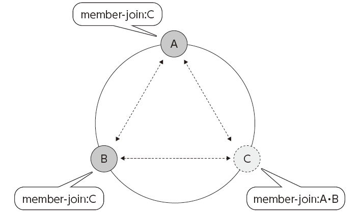
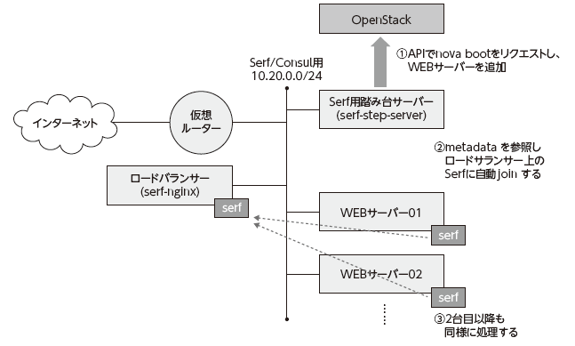

Serf による自律システム構築
===========================

----

概要
================

- ロードバランサーを使ったシステムで、ウェブサーバーを追加した際に、自動的にロードバランサーに登録されたら便利ですよね。
- ここでは Serf というツールを使って、ウェブサーバーを起動すると、
  自動的にサーバー追加を検知し、ロードバランサーに設定追加が行われる様子を体験いただきます。

----

操作環境の準備
================

- まず、下記のコマンドで、演習環境の準備を行います。
  コマンドの実行が完了するまで1〜2分かかります。
- インターネットからアクセスできるロードバランサーの仮想マシンが起動されます。
- ロードバランサーの URL と SSH ログイン先が表示されます。動作確認に使用します。

コマンド実行::

  $ /opt/support/t2-c3/1_init.sh
          <--- ディレクトリー「/opt/support/t2-c3」を使用します。
  ...（中略）... 

  Load Balancer URL: http://118.67.96.118/
  Log in to Loadbalancer server:
    ssh -i default.pem root@118.67.96.118
  $

----

Serf とは
=========

- Serf はクラスター状態管理を行うシンプルなツールです。
- クラスターへのメンバーの追加・削除などを検知すると、
  全メンバーにイベントが送付されます。
- 今回は、ウェブサーバーの参加イベントを受けると、
  ロードバランサーの設定を追加します。

----

ウェブサーバー自動追加のシナリオ
============================

- ウェブサーバーをコマンドで起動すると、起動が完了すると
  自動的にロードバランサーのメンバーに追加されます。
- ロードバランサーにログインして、
  設定ファイルでその様子を確認します。 

----

1 台目のウェブサーバーの起動
====================

- 1 台目のウェブサーバーを起動してみましょう。
- 引き数はウェブサーバーの番号です。

コマンドの実行::

  $ /opt/support/t2-c3/boot_web.sh 1
  
  ...
  +--------------------------------------+------------+--------+------------+-------------+------------------------------------------+
  | ID                                   | Name       | Status | Task State | Power State | Networks                                 |
  +--------------------------------------+------------+--------+------------+-------------+------------------------------------------+
  | 2b6375ee-3eda-4b81-9656-1bcafe7fe2fd | serf-nginx | ACTIVE | -          | Running     | serf-consul-net=10.20.0.1, 118.67.96.117 |
  | 0baddb5d-6be8-414f-aca1-6ac86af9f15e | serf-web1  | ACTIVE | -          | Running     | serf-consul-net=10.20.0.3                |
  +--------------------------------------+------------+--------+------------+-------------+------------------------------------------+
  
  Web server 'serf-web1' is now prepared.

----

ロードバランサーの動作確認
====================

- 起動が終わったら、ブラウザーを開いてロードバランサーにアクセスします。

  - URL: http://xxx.xxx.xxx.xxx/

  - アドレスは、以下のコマンドで表示される ``serf-nginx`` の 2 つ目のアドレス (118.xxx...) を使用します。

- 何度かリロードして、表示される文字列 (ウェブサーバー名) が
  変わらないことを確認します。

コマンドの実行::

  $ nova list
  +--------------------------------------+------------+--------+------------+-------------+------------------------------------------+
  | ID                                   | Name       | Status | Task State | Power State | Networks                                 |
  +--------------------------------------+------------+--------+------------+-------------+------------------------------------------+
  | 2b6375ee-3eda-4b81-9656-1bcafe7fe2fd | serf-nginx | ACTIVE | -          | Running     | serf-consul-net=10.20.0.1, 118.67.96.117 |
  | 0baddb5d-6be8-414f-aca1-6ac86af9f15e | serf-web1  | ACTIVE | -          | Running     | serf-consul-net=10.20.0.3                |
  +--------------------------------------+------------+--------+------------+-------------+------------------------------------------+

----

ウェブサーバーの追加
====================

- ウェブサーバーを何台か追加してみましょう。
- 最後の数字を変えて、台数分だけコマンドを実行します。

コマンドの実行::

  $ /opt/support/t2-c3/boot_web.sh 2
  $ /opt/support/t2-c3/boot_web.sh 3

----

ロードバランサーの動作確認
====================

- 起動が終わったら、さきほどのページでロードバランサーの状況を確認します。
- 何度かリロードして、表示される文字列が変わっていくことを確認してください。

----

ウェブサーバーを減らしてみる
===========================

- ウェブサーバーを減らしてみましょう。
- 名前に **web** が入っている VM を削除してみます。

コマンドの実行::

  $ nova delete serf-web2
  $ nova list
  (削除した VM が消えたことを確認します)

- 何度かリロードして、表示される文字列 (ウェブサーバー名) に
  削除したウェブサーバーの名前がないことを確認します。

----

もう少し時間がある方へ
===================================

- ロードバランサー VM にログインして、いくつかのコマンドを実行しす。
- これまでの手順を参考に、ウェブサーバーを増減させて、
  これらのコマンドを実行すると、自動で変化することが分かります。

コマンドの実行例::

  $ ssh -i default.pem root@xxx.xxx.xxx.xxx
  [serf-nginx]$ serf members

  [serf-nginx]$ cat /etc/nginx/conf.d/lbs_upstream.conf

----

後かたずけ
================

- 以下のコマンドを実行して、起動した仮想マシンをすべて削除します。
- 下記のように、操作用仮想マシンからログアウトして、仮想マシンを削除するスクリプトを実行します。

コマンド実行の様子::

  $ /opt/support/common/9_cleanup.sh
  ### delete all instances
  # delete instance: 43a929db-44ca-4754-a8bb-bd3c1981affa
  # delete instance: 0b602aaf-5a18-4441-9876-c21300e1ff2d
  ...
  ### delete all FIPs
  # delete FIP: 118.67.96.118
  ########## completed !!

----

ポイントとまとめ
================

- ここでは Serf というツールを使って、
  ウェブサーバーを起動すると、
  自動的にサーバー追加・削除を検知し、
  ロードバランサーに設定増減が行われる様子を確認しました。
- serf を使うと、クラスターの状態変化をトリガーにして自律的に
  システム構成変更ができます。
- OpenStack API などと組み合わせて、システム全体を自律的に
  スケールさせるなど、様々な応用が考えられるでしょう。
 
----

