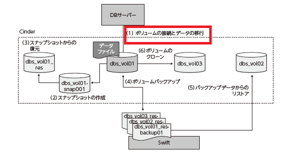
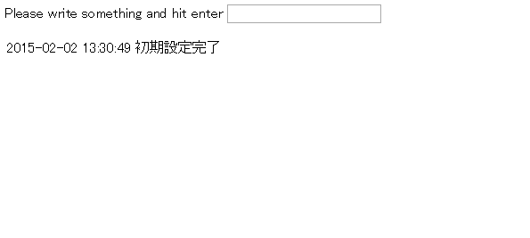

ボリュームの作成と接続
================

----

概要
================

- ここではサンプルアプリケーションのデータベース上のデータをボリュームに移行します。
- まずOpenStack上にボリュームを作成し、サンプルアプリケーションの稼働する仮想サーバーにマウントします。
- マウントしたボリュームにデータベース上のデータを移行し、サンプルアプリケーションを稼働させます。

----

操作環境の準備
================

- 下記のコマンドではサンプルアプリケーションの動作する仮想サーバーを起動し、Floating IPを割り当てています。起動には１分から数分かかります。

初期設定実行::

  --- ここから ---
  
  $ cd /opt/support/t3-c2
  $ ./01_init.sh
  # Creating seurity-group :sg-for-web-student03
  # Booting Server :t3-c2-student03
  # Create Floating IP
  # Associate Floating IP <Floating IP>
  # t3-c2-student03 : <Floating IP>
  --- ここまで ---

----

操作環境の確認(1)
================

- 作成した仮想マシンにログインし、ディスクの状態を確認します。

仮想マシンの操作::

  --- ここから ---
  # ssh  -i ~/default.pem root@<Floating IP> -i default.pem
  
  # lsblk
  NAME   MAJ:MIN RM SIZE RO TYPE MOUNTPOINT
  vda    252:0    0  10G  0 disk 
  └─vda1 252:1    0  10G  0 part /
  vdb    252:16   0  10G  0 disk /mnt

  # exit
  --- ここまで ---

----

操作環境の確認(2)
================

- ブラウザからサンプルアプリケーションを開き、データを登録します。

----

ボリュームの作成と接続
================

- それではボリュームを作成します。

cinderコマンドによるボリュームの作成::

  --- ここから ---
  cinder create --display-name vol01-${USER} 10 
  +---------------------+--------------------------------------+
  |       Property      |                Value                 |
  +---------------------+--------------------------------------+
  (中略)
  |      created_at     |      2015-01-29T12:13:40.743312      |
  | display_description |                 None                 |
  |     display_name    |            vol01-${USER}             |
  |          id         |     < 表示されるIDを控えます。>      |
  (中略)
  |        status       |               creating               |
  |     volume_type     |                 None                 |
  +---------------------+--------------------------------------+
  --- ここまで ---

----

仮想マシンへのボリュームの接続
================

- 作成したボリュームを仮想マシンへ接続します。ボリュームの接続にはボリュームのUUIDを指定します。

cinderコマンドによるボリュームの作成::

  --- ここから ---
  nova volume-attach t3-c2-${USER} <作成したボリュームのID>
  +----------+--------------------------------------+
  | Property | Value                                |
  +----------+--------------------------------------+
  | device   | /dev/vdc                             |
  | id       | 2237cdb7-7174-42fe-b169-a0e825ab9d52 |
  | serverId | d53c42b6-7242-4b40-8581-647c01eb19fb |
  | volumeId |     <作成したボリュームのID>         |
  +----------+--------------------------------------+
  --- ここまで ---

----

仮想マシンへのログイン
================

- 作成した仮想マシンにログインしディスクが接続されていることを確認します。

仮想マシンの操作::

  --- ここから ---
  $ ssh  -i ~/default.pem root@<Floating IP>
  $ lsblk
  NAME   MAJ:MIN RM SIZE RO TYPE MOUNTPOINT
  vda     252:0    0  10G  0 disk 
  └-vda1 252:1    0  10G  0 part /
  vdb     252:16   0  10G  0 disk /mnt
  vdc     252:32   0  10G  0 disk          <- 追加されていることを確認
  --- ここまで ---

----

ボリュームのパーティション
================

- ディスクのパーティションを行います。

仮想マシンの操作::

  --- ここから ---
  # fdisk /dev/vdc
  コマンド (m でヘルプ): n                <- "n" を入力
  p
  パーティション番号 (1-4): 1             <- "1" を入力
  最初 シリンダ (1-20805, 初期値 1):      <- Enterを押下(デフォルト)
  Last シリンダ, +シリンダ数 or +size{K,M,G} (1-20805, 初期値 20805):   <- Enterを押下(デフォルト)
  コマンド (m でヘルプ): p                <- "p" を入力(設定確認)
  ...（中略）...
  デバイス ブート 始点 終点 ブロック Id システム
  /dev/vdc1 1 20805 10485688+ 83 Linux
  ...（中略）...
  コマンド (m でヘルプ): w                <- "w" を入力(書き込み)
  
  # lsblk /dev/vdc
  NAME MAJ:MIN RM SIZE RO TYPE MOUNTPOINT
  vdc 252:32 0 10G 0 disk
  └─vdc1 252:33 0 10G 0 part           <- パーティションが作成されていることを確認
  
  --- ここまで ---

----

ディスクのフォーマット
================

- パーティションを作成できたら、ファイルシステムを作成して仮のマウントポイント/tmp/data にマウントします。
- ここではラベル "mysql_data" をつけています。

仮想マシンの操作::

  --- ここから ---
   # mkfs.ext4 -L mysql_data /dev/vdc1
   # tune2fs -c 0 -i 0 -r 0 /dev/vdc1
   # mkdir /tmp/data
   # mount LABEL=mysql_data /tmp/data
  --- ここまで ---

----

MySQL データの移行(1)
================

- MySQLを停止してデータを移行します。まずは、仮のマウントポイントにマウントしデータを移動します。

仮想マシンの操作::

  --- ここから ---
  # chown -R mysql:mysql /tmp/data
  # service mysqld stop
  # mv /var/lib/mysql/* /tmp/data/
  # ls -lF /tmp/data/
  -rw-rw---- 1 mysql mysql 5242880 9月 3 16:01 2014 ib_logfile0
  -rw-rw---- 1 mysql mysql 5242880 8月 31 06:01 2014 ib_logfile1
  -rw-rw---- 1 mysql mysql 10485760 9月 3 16:01 2014 ibdata1
  drwx------ 2 mysql mysql 16384 8月 31 06:01 2014 lost+found/
  drwx------ 2 mysql mysql 4096 8月 31 06:01 2014 mysql/
  drwx------ 2 mysql mysql 4096 8月 31 06:06 2014 sample_bbs/
  drwx------ 2 mysql mysql 4096 8月 31 06:01 2014 test/
  --- ここまで ---

----

MySQL データの移行(2)
================

- 移動したデータでMySQLを起動します。データを移した/tmp/dataを一旦アンマウントしてから、MySQLのデータディレクトリにマウントし直します。
- MySQL再起動後、サンプルアプリケーションの再起動を行います。

仮想マシンの操作::

  --- ここから ---
  # umount /tmp/data/
  # mount LABEL=mysql_data /var/lib/mysql
  # df -h /var/lib/mysql
  Filesystem Size Used Avail Use% Mounted on
  /dev/vdc1 9.9G 172M 9.7G 2% /var/lib/mysql
  # service mysqld start
  # sh ~/sample-app/server-setup/rest.init.sh restart
  # exit
  --- ここまで ---

----

サンプルアプリケーションの動作確認
================

- ブラウザからサンプルアプリケーションを操作し、書き込みができることを確認します。

----

後片付け
================

- 作業を完了する場合は、以下のコマンドを実行し、作成した仮想マシンとFloating-IPを全て削除してください。
- 引き続きボリュームのスナップショット、バックアップを行う場合は片付けをせずに次に進んでください。

コマンド実行の様子::

  ---- ここから ----
  # exit
  # pwd
  /opt/support/t3-c2  # <---「/opt/support/t3-c2」にいることを確認します。
  # ./99_cleanup.sh
  ---- ここまで ----

----

まとめ
================

- 仮想マシンをボリュームにマウントし、MySQLのデータをエフェメラルディスク上からボリューム上に移行しました。
- ボリュームのスナップショット機能、バックアップ機能を利用したデータの保護を行うことができるようになります。

