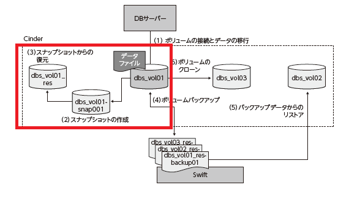
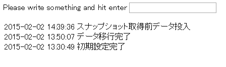
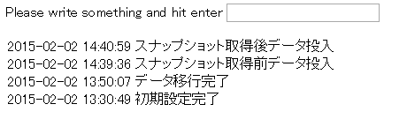
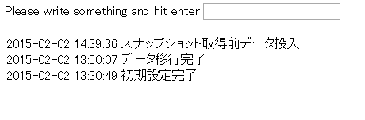
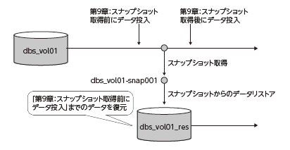

スナップショットとリストア
================

----

概要
================

- ここでは作成しデータを書き込みしたボリュームのスナップショットを作成し、さらにそのスナップショットからボリュームをリストアします。
- リストアしたボリュームがスナップショット作成前のボリュームと同じ内容であることを確認します。

----

操作環境の準備
================
- はじめに操作環境を準備します。
- 「ボリュームの作成と接続」を実施している場合この操作は不要です。

コマンド実行の様子::

  ---- ここから ----
  $ cd /opt/support/t3-c3
  $ ./01_init.sh
  ---- ここまで ----

----

スナップショット取得前のデータ登録
================

----

DBの停止とアンマウント
================

- スナップショットを取得する前に、MySQLを停止してファイルシステムをアンマウントすることに
より、データの静止点を作ります。

コマンドの実行::

  --- ここから ---
  # ssh -i default.pem root@${FLOATINGIP}
  # service mysqld stop
  # umount /var/lib/mysql
  # exit
  # cinder list
  +----------------------+--------+-----------------+------+-------------+----------+-----------------------------+
  |     ID               | Status |   Display Name  | Size | Volume Type | Bootable |      Attached to            |
  +----------------------+--------+-----------------+------+-------------+----------+-----------------------------+
  | <ボリュームID>       | in-use | vol01-student03 |  10  |     None    |  false   | <仮想マシンのID>            |
  +----------------------+--------+-----------------+------+-------------+----------+-----------------------------+
  # nova volume-detach <仮想マシンのID> <ボリュームID>
  --- ここまで ---

----

スナップショットの作成
================

- ボリュームのスナップショットを作成します。

コマンドの実行::

  --- ここから ---
  # cider snapshot-create --display-name vol01-${USER}-snap001 <ボリュームID>
  +---------------------+--------------------------------------+
  |       Property      |                Value                 |
  +---------------------+--------------------------------------+
  |      created_at     |      2015-02-02T05:30:22.366756      |
  | display_description |                 None                 |
  |     display_name    |        vol01-student03-snap01        |
  |          id         | dda17502-d11e-44c8-8214-695e6d6513d4 |
  |       metadata      |                  {}                  |
  |         size        |                  10                  |
  |        status       |               creating               |
  |      volume_id      | 634c5b8d-6650-4f89-8218-04bb296be3f1 |
  +---------------------+--------------------------------------+  

  --- ここまで ---

----

ボリュームの再接続
================

- スナップショットを作成する前の状態のデータベースに書き込みを行うため、ボリュームを再接続します。

コマンドの実行::

  --- ここから ---
  # nova volume-attach <仮想マシンのID> <ボリュームID>
  +----------+--------------------------------------+
  | Property | Value                                |
  +----------+--------------------------------------+
  | device   | /dev/vdc                             |
  | id       | da3e922c-c98b-4f73-9b8c-7eb060bc466e |
  ...（以下省略）...

  # ssh -i default.pem root@${FLOATINGIP}
  # mount LABEL=mysql_data /var/lib/mysql/ && service mysqld start
  # sh /root/sample-app/server-setup/rest.init.sh restart
  # exit 

  --- ここまで ---

----

データの追加
================

- 画面からデータを追加します

----

スナップショットからのリストア
================

- 取得したスナップショットからデータをリストアします。

コマンドの実行::

  --- ここから ---
  
  # source getuuid.sh
  # source vars.sh
  # export MY_VOL01_SNAP001=`cinder snapshot-show ${VOL01}-snap01|get_uuid` 
  # echo $MY_VOL01_SNAP001
  # cinder create --snapshot-id ${MY_VOL01_SNAP001} --display-name ${RES01} 10
  +---------------------+--------------------------------------+
  |       Property      |                Value                 |
  +---------------------+--------------------------------------+
  (中略)
  |     display_name    |         vol01-student03_res          |
  |          id         |         <リストアボリュームのID>     |
  |       metadata      |                  {}                  |
  |         size        |                  10                  |
  |     snapshot_id     | dda17502-d11e-44c8-8214-695e6d6513d4 |
  (後略)
  --- ここまで ---

----

リストアしたボリュームの接続
================

- リストアしたボリュームを接続し、ボリュームが追加されていることを確認します。

コマンドの実行::

  --- ここから ---

  # nova volume-attach allinone-student03  <リストアボリュームのID>
  +----------+--------------------------------------+
  | Property | Value                                |
  +----------+--------------------------------------+
  | device   | /dev/vdd                             |
  (後略)
  
  # ssh -i ~/default.pem root@${FLOATINGIP}
  # lsblk
  NAME MAJ:MIN RM SIZE RO TYPE MOUNTPOINT
  ～～～（中略）～～～
  vdc 252:32 0 10G 0 disk
    vdc1 252:33 0 10G 0 part /var/lib/mysql
  vdd 252:48 0 10G 0 disk
    vdd1 252:49 0 10G 0 part                <- 新たにボリュームがマウントされていることを確認
  --- ここまで ---

----

リストアしたボリュームの接続
================

- データベースのデータディレクトリをリストアしたボリュームに付け替えます。データがスナップショット取得前の状態に戻っていることを確認してください。

コマンドの実行::

  --- ここから ---
  # mysql -u root sample_bbs -e 'select * from contents;'
  +----+---------------------+--------------------------------------------------+
  | id | timestamp           | text                                             |
  +----+---------------------+--------------------------------------------------+
  (中略)
  |  3 | 2015-02-02 14:39:36 | スナップショット取得前データ投入                   |
  |  4 | 2015-02-02 14:40:59 | スナップショット取得後データ投入                   |
  +----+---------------------+--------------------------------------------------+
  # service mysqld stop && umount /var/lib/mysql
  # mount /dev/vdd1 /var/lib/mysql/ && service mysqld start
  # mysql -u root sample_bbs -e 'select * from contents;'
  +----+---------------------+--------------------------------------------------+
  | id | timestamp           | text                                             |
  +----+---------------------+--------------------------------------------------+
  (中略)
  |  3 | 2015-02-02 14:39:36 | スナップショット取得前データ投入                   |
  +----+---------------------+--------------------------------------------------+
  # sh /root/sample-app/server-setup/rest.init.sh restart
  # exit
  --- ここまで ---

----

サンプルアプリケーションの再起動
================

- ブラウザ上でもデータが前に戻っていることを確認します。

----

後片付け
===============

- 以下のコマンドを実行し、スナップショットの削除を行ってください。
- 引き続きボリュームのバックアップとリストアに進む場合でも、以下操作を実行してください。

コマンド実行の様子:

  ---- ここから ----
  # pwd
  /opt/support/t3-c3  # <---「/opt/support/t3-c3」にいることを確認します。
  # ./99_cleanup.sh
  ---- ここまで ----

----

まとめ
===============

- ボリュームのスナップショットによるデータのリストアを実行しました。
- これにより以下のようにデータベース状態をスナップショット取得時の状態に戻すことができました。

