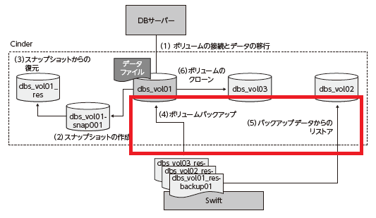
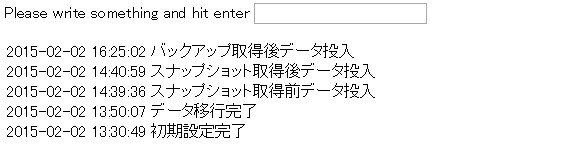
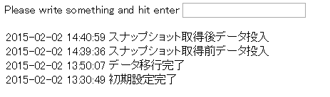

バックアップとリストア
================

----

概要
================

- ここではMySQLのデータが存在するボリュームをCinderのバックアップ機能によりバックアップし、そこからリストアする操作を行います。
- リストアしたボリュームがスナップショット作成前のボリュームと同じ内容であることを確認し、バックアップ機能を実感してください。

----

操作環境の準備
================
- はじめに操作環境を準備します。
- 「ボリュームの作成と接続」を実施している場合この操作は不要です。

コマンド実行の様子::

  ---- ここから ----
  $ cd /opt/support/t3-c4
  $ ./01_init.sh
  ---- ここまで ----

----

DBの停止とアンマウント
================

- 最初にDBを停止してボリュームをアンマウントします。

コマンドの実行::

  --- ここから ---
  # ssh -i ~/default.pem root@${FLOATINGIP}
  # service mysqld stop 
  # umount /var/lib/mysql
  # exit
  # nova volume-detach ${TESTSERVER} <ボリュームID>
  --- ここまで ---

----

バックアップの作成
================

- ボリュームのバックアップを作成します。作成中はボリュームの状態が「backing-up」となり、完了するまでボリューム操作ができません。数分待って、状態がavailableになってからボリューム操作を行ってください。

コマンドの実行::

  --- ここから ---
  # cinder backup-create ${VOL01}
  +-----------+--------------------------------------+
  |  Property |                Value                 |
  +-----------+--------------------------------------+
  |     id    | 8acc7521-fddb-4a0a-9bc4-4ccc2a784768 |
  |    name   |                 None                 |
  | volume_id | 45dee040-cb87-4c38-be9b-1dca3aec25ce |
  +-----------+--------------------------------------+
  # cinder list
  +--------------------------------------+------------+------------------+------+-------------+----------+-------------+
  |                  ID                  |   Status   |   Display Name   | Size | Volume Type | Bootable | Attached to |
  +--------------------------------------+------------+------------------+------+-------------+----------+-------------+
  | 45dee040-cb87-4c38-be9b-1dca3aec25ce | backing-up | volume-student03 |  10  |     None    |  false   |             |
  +--------------------------------------+------------+------------------+------+-------------+----------+-------------+
  --- ここまで ---

----

Swift 上のバックアップデータの確認
================

- 本環境ではボリュームのバックアップはSwiftのコンテナ上にバックアップされます。バックアップされたデータをSwiftのコマンドで確認します。

コマンド操作::

  --- ここから ---
  # swift list volumebackups
  volume_45dee040-cb87-4c38-be9b-1dca3aec25ce/20150202025933/az_az2_backup_0c6bfa72-65a9-4b31-8d08-f0df6aed3418-00001
  (中略)
  volume_45dee040-cb87-4c38-be9b-1dca3aec25ce/20150202025933/az_az2_backup_0c6bfa72-65a9-4b31-8d08-f0df6aed3418_metadata
  --- ここまで ---

----

ボリュームの再接続
================

- バックアップが完了したらボリュームを再接続します。

コマンド操作::

  --- ここから---
  # nova volume-attach ${TESTSERVER} <ボリュームID>
  # ssh -i ~/default.pem root@${FLOATINGIP}
  # mount LABEL=mysql_data /var/lib/mysql && service mysqld start  
  # sh /root/sample-app/server-setup/rest.init.sh restart
  # exit
  --- ここまで ---

----

リストア確認用データの登録
================

- ブラウザからFloating IP を開き、データを登録します。

----

バックアップボリュームのリストア
================

- リストア用のボリュームを作成します。バックアップしたボリュームと同サイズで作成してください。
- リストアにも数分かかります。cinder list コマンドで状態を確認し、「available」となってから次の操作に進んでください。

コマンド操作::

  --- ここから ---
  # cinder create --display-name ${BKUP01} 10
  +---------------------+--------------------------------------+
  |       Property      |                Value                 |
  (略)
  |          id         | <作成されたボリュームのID>           |

  # cinder backup-restore --volume-id <作成されたボリュームのID> <バックアップのID>
  # cinder list
  +--------------------------------------+------------------+------------------+------+-------------+----------+--------------------------------------+
  |                  ID                  |      Status      |   Display Name   | Size | Volume Type | Bootable |             Attached to              |
  +--------------------------------------+------------------+------------------+------+-------------+----------+--------------------------------------+
  | 1e1de15c-138f-47ca-8e0a-8c848757a59e | restoring-backup | vol01-st-bkup01  |  10  |     None    |  false   |                                      |
  --- ここまで ---

----

リストアされたボリュームの接続
================

- リストアされたボリュームを接続して、データベースとサンプルアプリケーションを再起動します。

コマンド操作::

  --- ここから ---
  # nova volume-attach ${TESTSERVER} <作成されたボリュームのID>
  # ssh -i ~/default.pem root@${FLOATINGIP}
  # lsblk
  # service mysqld stop && umount /var/lib/mysql
  # mount /dev/vdd1 /var/lib/mysql && service mysqld start
  # sh /root/sample-app/server-setup/rest.init.sh restart
  # exit  
  --- ここまで ---

----

リストアされたデータの確認
================

- ブラウザからサンプルアプリケーションを開き、データがリストアされていることを確認します。

----

後片付け
================

- 以下のコマンドを実行し、ボリューム及び仮想マシンの削除を行ってください。
- この章で利用した全てのリソースを削除します。

コマンド実行の様子::

  ---- ここから ----
  # pwd
  /opt/support/t3-c4  # <---「/opt/support/t3-c4」にいることを確認します。
  # ./99_cleanup.sh
  ---- ここまで ----

----

まとめ
================

- ボリュームのバックアップとリストアを実行しました。
- バックアップに保存することにより、より信頼性の高いバックアップを実施することができます。

