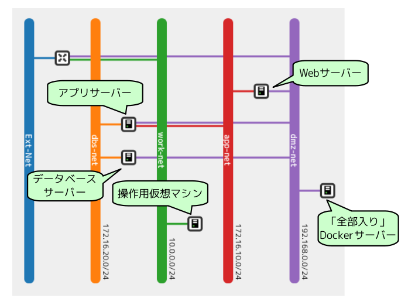

DockerとOpenStack
================

----

概要
================

- ここではOpenStackの仮想マシン上にDockerでアプリケーションを配布します。

- 配布用のDockerイメージは、事前にDocker Hubで公開してあります。

- https://registry.hub.docker.com/search?q=enakai00 にアクセスすると、次の3つのDockerイメージが用意されています。

  - enakai00/web : 掲示板アプリのフロントWebサーバー

  - enakai00/app : 掲示板アプリのアプリサーバー

  - enakai00/dbs : 掲示板アプリのデータベースサーバー

----

操作環境の準備
================

- 下記のコマンドで、Ansibleが導入された操作用仮想マシンを用意します。

  - コマンドの実行が完了するまで数分かかります。

  - "student01" の部分には、操作端末に応じた番号が割り当てられます。

コマンド実行の様子::

  ---------ここから---------
  $ cd /opt/support/t4-c1  # <--- ディレクトリー「/opt/support/t4-c1」を使用します。
  $ ./01_init.sh
  Cleaning up...
  Booting student01-step-server...
  ...（中略）... 
  Done.

  Use the following command to login student01-step-server
  => ssh -i /opt/support/t4-c1/keys/student01-key-for-step-server.pem ansible@15.126.249.225
  ---------ここまで---------

----

操作用仮想マシンへのログイン
================

- 最後に表示されたsshコマンドで、操作用仮想マシンにログインします。

コマンド実行の様子::

  ---------ここから---------
  $ ssh -i /opt/support/t4-c1/keys/student01-key-for-step-server.pem ansible@15.126.249.225
  Last login: Thu Jan 29 19:02:46 2015 from 118.67.96.50
  (venv)[ansible@student01-step-server ~]$ 
  ---------ここまで---------

----

userdataによるアプリの自動配布(1)
================

- Dockerが導入された仮想マシンを起動して下記のスクリプトを実行すると、dbs（データベース）、app（アプリサーバー）、web（Webサーバー）の3種類のコンテナーが起動して、掲示板アプリが利用可能になります。

- ここでは、このスクリプトをuserdataとして自動実行することで、仮想マシンの起動からアプリケーションの配布までを自動化します。

スクリプトの内容::

  ---------ここから---------
  $ cat $HOME/userdata_docker-all.txt 
  #!/bin/bash
  service docker start
  docker run -itd --name dbs enakai00/dbs:ver1.0
  docker run -itd --name app --link dbs:db enakai00/app:ver1.0
  docker run -itd --name web --link app:rest -p 80:80 enakai00/web:ver1.0
  ---------ここまで---------

----

userdataによるアプリの自動配布(2)
================

- 下記のコマンドを実行して、先ほどのスクリプトをuserdataに指定して仮想マシンを起動します。

  - $STUDENT には利用端末に応じた値が自動設定されています。下記の通りにコマンドを入力します。

  - ここで使用するテンプレートイメージ "docker-base" には、事前にDockerが導入されています。

コマンド実行::

  ---------ここから---------
  $ cd $HOME
  $ nova boot --flavor standard.xsmall --image "docker-base" \
    --key-name key-for-internal \
    --security-groups sg-all-from-console,sg-web-from-internet \
    --availability-zone az1 --nic net-id=${OS_DMZ_NET} \
    --user-data userdata_docker-all.txt \
    $STUDENT-docker-all
  ---------ここまで---------

----

userdataによるアプリの自動配布(3)
================

- 下記のコマンドを実行すると、起動中の仮想マシンのコンソールログ（末尾の10行）が10秒ごとに表示されます。

  - タイミングにより "ERROR: The resource could not be found." と表示されますが、これは問題ありません。

  - ゲストOSの起動中に、userdataからアプリケーションの配布が実施されますので、起動完了までは少し時間がかかります。

  - ゲストOSの起動が完了して、コンソールログにログインプロンプトが表示されるまで待ちます。

コマンド実行::

  ---------ここから---------
  $ watch -n10 nova console-log --length 10 $STUDENT-docker-all
  ---------ここまで---------

----

userdataによるアプリの自動配布(4)
================

- ゲストOSの起動が完了したら、下記のコマンドでフローティングIPを割り当てます。

  - 最初のコマンドで未使用のフローティングIPを確認して、任意の1つを「xxx.xxx.xxx.xxx」に指定します。

  - 未使用のフローティングIPは、"fixed_ip_address" と "port_id" が空欄になっています。

コマンド実行::

  ---------ここから---------
  $ neutron floatingip-list
  $ nova floating-ip-associate $STUDENT-docker-all xxx.xxx.xxx.xxx
  ---------ここまで---------

- Webブラウザーから http://xxx.xxx.xxx.xxx にアクセスすると掲示板アプリが利用できます。

----

構築した環境の全体像
================

- ここで構築した環境は下図のようになります。

  - 「OpenStackクラウドインテグレーション」より引用

.. image:: ./_assets/t4-c1/01_singlevm.png
     :width: 70%

----

コンテナ稼働状態の確認
================

- 仮想マシンにログインすると、dockerコマンドでコンテナが稼働している様子を確認することもできます。

  - "dmz-net" に割り当てられたIPでログインします。

コマンド実行の様子::

  ---------ここから---------
  $ nova list --field name,networks | grep $STUDENT-docker-all
  | 49a7500e-bd5f-4314-bffc-af0ddaa7bb3f | student07-docker-all | dmz-net=192.168.0.11, 15.126.244.49 |
  $ ssh -i key-for-internal.pem root@192.168.0.11
  The authenticity of host '192.168.0.11 (192.168.0.11)' can't be established.
  RSA key fingerprint is b4:c7:29:28:d1:bb:b9:c1:0d:42:4f:ae:54:5c:be:54.
  Are you sure you want to continue connecting (yes/no)? yes
  [root@student01-docker-all ~]# docker ps
  CONTAINER ID        IMAGE                 COMMAND                CREATED             STATUS              PORTS                NAMES
  21d4bf1976cc        enakai00/web:ver1.0   "/usr/local/bin/init   31 minutes ago      Up 31 minutes       0.0.0.0:80->80/tcp   web                 
  f070bf98988a        enakai00/app:ver1.0   "/usr/local/bin/init   32 minutes ago      Up 32 minutes       5555/tcp             app                 
  84a883992849        enakai00/dbs:ver1.0   "/usr/local/bin/init   34 minutes ago      Up 34 minutes       3306/tcp             dbs                 
  [root@student01-docker-all ~]# logout
  ---------ここまで---------

----

Ansibleによるアプリの自動配布(1)
================

- Ansibleを使うと、複数の仮想マシンの連携設定が可能です。ここでは、dbs、app、webの3種類のコンテナーを別々の仮想マシンで起動します。

- 演習環境では、リソース不足で仮想マシン起動時にタイムアウトエラーになることがあります。その際は、下記のコマンドで "ACTIVE" でない仮想マシンを削除して、再度、ansible-playbookコマンドを実行してください。

ACTIVEでない仮想マシンを削除する例::

  ---------ここから---------
  $ nova list --field name,status | grep -E "$STUDENT-(web|app|dbs)"
  | 130b1217-2612-4cdd-8cb3-4c7f67ea0b81 | student01-app-ef5527ee-ae89-4984-aa90-f78d21b92eda | ACTIVE |
  | 01115055-6248-4309-88e0-bb0d72cb341f | student01-dbs-8891d993-e479-4b94-a9db-a00b8e0d3485 | ACTIVE |
  | 7d18c162-5fa7-469c-8550-220f260f417e | student01-web-d3009fae-82d8-4069-9d79-2617395ede84 | BUILD  |
  $ nova delete student1-web-d3009fae-82d8-4069-9d79-2617395ede84
  ---------ここまで---------

----

Ansibleによるアプリの自動配布(2)
================

- 下記のコマンドで3つの仮想マシンを起動します。

  - "-e target=" で、作成する仮想マシンの種類を指定しています。下記の順番に起動してください。

  - ansible-playbookコマンドは、仮想マシンの起動が開始したタイミングで終了します。1つのコマンドが終了してから次のコマンドの実行に進んでください。

コマンド実行::

  ---------ここから---------
  $ cd $HOME
  $ ansible-playbook -i ansible_hosts -e target=dbs create_docker_vm.yml
  $ ansible-playbook -i ansible_hosts -e target=app create_docker_vm.yml
  $ ansible-playbook -i ansible_hosts -e target=web create_docker_vm.yml
  ---------ここまで---------

----

Ansibleによるアプリの自動配布(3)
================

- 下記のコマンドで仮想マシンにアプリを配布します。

  - "-e target=" で、アプリを配布する仮想マシンの種類を指定しています。下記の順番に配布を行ってください。

  - ansible-playbookコマンドは、アプリの配布が完了したタイミングで終了します。1つのコマンドが終了してから次のコマンドの実行に進んでください。

コマンド実行::

  ---------ここから---------
  $ cd $HOME
  $ ansible-playbook -i sample_app_inventory.py \
    -e target=dbs -e docker_user=enakai00 -u root do_docker_run.yml
  $ ansible-playbook -i sample_app_inventory.py \
    -e target=app -e docker_user=enakai00 -u root do_docker_run.yml
  $ ansible-playbook -i sample_app_inventory.py \
    -e target=web -e docker_user=enakai00 -u root do_docker_run.yml
  ---------ここまで---------

----

Ansibleによるアプリの自動配布(4)
================

- Webサーバー用の仮想マシンには自動でフローティングIPが割り当てられています。

- 下記のコマンドでフローティングIPを確認して、Webブラウザーでアクセスすると、掲示板アプリが利用できます。

  - "dmz-net" の2つ目のIP（この例では "15.126.248.84"）がフローティングIPになります。

コマンド実行の様子::

  ---------ここから---------
  $ nova list --field name,networks | grep $STUDENT-web
  | 7d18c162-5fa7-469c-8550-220f260f417e | student07-web-d3009fae-82d8-4069-9d79-2617395ede84 | dmz-net=192.168.0.13, 15.126.248.84; app-net=172.16.10.9 |
  ---------ここまで---------
 

----

環境した構築の全体像
================

- ここで構築した環境は下図のようになります。

  - 「OpenStackクラウドインテグレーション」より引用

.. image:: ./_assets/t4-c1/02_multivm.png
     :width: 70%

----

ネットワーク構成の全体像(1)
================

- この演習で作成した仮想マシンの仮想ネットワーク接続は下図のようになります。

----

ネットワーク構成の全体像(2)
================

- 仮想マシンの接続ネットワークは、下記のコマンドで確認できます。

コマンド実行の様子::

  ---------ここから---------
  $  nova list --field name,networks | grep $STUDENT-
  | bfe565f1-b456-401c-8929-d7ed50eee302 | student01-app-1e17c851-69d3-4c07-aa65-785b1bdcc88a | dmz-net=192.168.0.19; app-net=172.16.10.11; dbs-net=172.16.20.9 |
  | e05f3a8c-2a53-4ee6-81e9-b5db65917d82 | student01-dbs-3c5d0680-4d6a-4ccc-9a0b-48cc318bc80b | dmz-net=192.168.0.18; dbs-net=172.16.20.8                       |
  | be8116ec-b58e-4821-a929-94798ab94aa3 | student01-docker-all                               | dmz-net=192.168.0.17, 15.126.248.51                             |
  | 65618b77-6321-4863-a06c-341947ef64c0 | student01-step-server                              | work-net=10.0.0.14, 15.126.193.22                               |
  | 6d8c8900-445e-4650-a842-87ad6f48bd72 | student01-web-55c6d9f5-34b0-4291-8b98-02152746f787 | dmz-net=192.168.0.20, 15.126.249.239; app-net=172.16.10.12      |
  ---------ここまで---------

----

後かたずけ
================

- 起動した仮想マシンをすべて削除します。
- 下記のように、操作用仮想マシンからログアウトして、仮想マシンを削除するスクリプトを実行します。

コマンド実行の様子::

  ---------ここから---------
  (venv)[ansible@student01-step-server ~]$ exit
  logout
  Connection to 15.126.249.225 closed.
  $ pwd       
  /opt/support/t4-c1  # <---「/opt/support/t4-c1」にいることを確認します。
  $ ./99_cleanup.sh
  Deleting student01-app-ef5527ee-ae89-4984-aa90-f78d21b92eda
  Deleting student01-dbs-5c6b09bf-c9e5-41f3-accc-426b507c1cb8
  Deleting student01-docker-all
  Deleting student01-step-server
  Deleting student01-web-d3009fae-82d8-4069-9d79-2617395ede84
  ---------ここまで---------

----

ポイントとまとめ
================

- OpenStackの仮想マシンとして「計算リソース」を用意した上で、Dockerイメージとしてパッケージングしたアプリを配布しました。

  - これにより、リソースの確保とアプリのパッケージングを分離して、柔軟なアプリ配置が可能になります。

  - この演習では、3つのアプリ（web、app、dbs）を1つの仮想マシンにをまとめて配布する構成と、3つの仮想マシンに分けて配布する構成を行いました。

- 複数の仮想マシン上のアプリを連携させる構成は、Ansibleなどの構成管理ツールを利用して自動化することが可能です。

