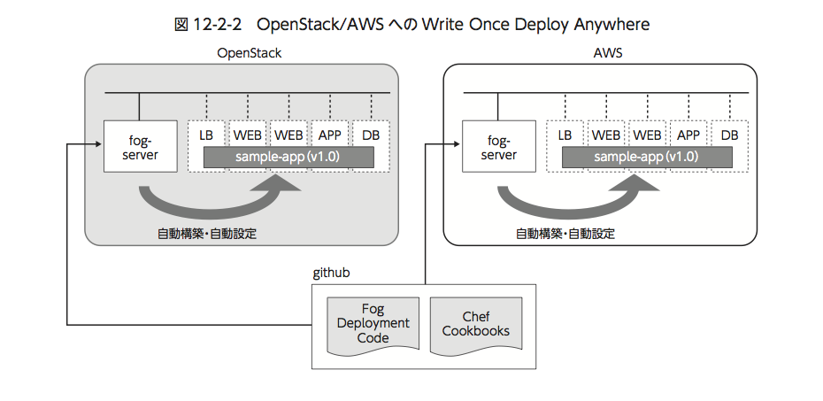

FogとChefを使ったアプリケーションデプロイ
================

----

概要
================

- ここではFogを用いて仮想マシンを複数台作成し、役割に応じてChefでデプロイを行います。

- 作成されるサーバは以下の通りです。studentXXの部分には、操作端末の番号が割り当てられます。

  - studentXXlb1 : 掲示板アプリのロードバランササーバー1

  - studentXXweb1 : 掲示板アプリのフロントWebサーバー1

  - studentXXweb2 : 掲示板アプリのフロントWebサーバー2

  - studentXXapp1 : 掲示板アプリのアプリサーバー

  - studentXXdb1 : 掲示板アプリのデータベースサーバー

----

操作環境の準備
================

- 下記のコマンドで、Fogが導入された操作用仮想マシンを用意します。

  - コマンドの実行が完了するまで数分かかります。

コマンド実行の様子::

  ---------ここから---------
  $ cd /opt/support/t4-c2
  $ ./01_init.sh
  (中略)

  ####init.sh finished. Please login to fog-server by following command
  ssh -i ~/default.pem -oStrictHostKeyChecking=no fog@IPアドレス
  ---------ここまで---------

----

操作用仮想マシンへのログイン
================

- 最後に表示されたsshコマンドで、操作用仮想マシンにログインします。

コマンド実行::

  ---------ここから---------
  $ ssh -i ~/default.pem -oStrictHostKeyChecking=no fog@IPアドレス
  ---------ここまで---------

----

仮想マシンの作成とアプリケーションデプロイの実行(1)
================

- Fogが導入された仮想マシンを起動して下記のスクリプトを実行すると、仮想マシンが作成されます。その後、各サーバーにアプリケーションに必要な機能がデプロイされ、掲示板アプリが利用可能になります。

コマンド実行::

  ---------ここから---------
  $ ~/deploy_app.sh
  ---------ここまで---------

----

仮想マシンの作成とアプリケーションデプロイの実行(2)
================

- コマンドを実行すると、以下のような流れで処理が進みます

  -サーバを作成するのに必要なデータは、yamlファイルで管理されます。そのため、 本デモではコマンド実行時にまずyamlファイルを作成します。作成されたyamlファイルは、$HOMEディレクトリにありますので、アプリケーションデプロイ後、確認することもできます。

  - yamlで定義された役割に応じて仮想マシンを作成します。完了すると『Create server studentXXdb1』と表示されます。

  - 作成したサーバーとicmpでの疎通ができるまで一定間隔でポーリングを繰り返します。疎通が取れると、『I found icmp session to student18db1』と表示され先に進みます。

  - 作成した全てのサーバとの疎通が確認できた時点で、Chefによるデプロイが開始されます。Chefサーバに必要なcookbookとroleがアップロードされ、デプロイを実行します。

  - デプロイが完了すると、実行ログのパスが表示されます。全てのサーバに対してデプロイが完了すると、処理を終了します。

  - また、最後にアプリケーションにアクセスするためのURLが表示されます。studentXXlb1サーバのローカルIPアドレスは、nova listコマンドで確認ください。

ログ::

  ---------ここから---------
  Created server student18db1
  (中略)
  waiting icmp session to student18db1
  I found icmp session to student18db1
  (中略)
  cookbooks uploaded.
  roles uploaded.
  (中略)
  deploy finished => student18db1
  check logfile => more /tmp/student18db1_bootstrap.log
  deploy finished => student18web1
  check logfile => more /tmp/student18web1_bootstrap.log
  (中略)
  Deploy finished. TRY w3m http://'local-ip-address-of-student18lb1' from this server
  ---------ここまで---------

----

構築した環境の全体像
================

- 今回、構築した環境は下図のようになります。

  - 「OpenStackクラウドインテグレーション」より引用

----

環境の削除
================

- 起動した仮想マシンをすべて削除します。
- 下記のように、操作用仮想マシンからログアウトして、仮想マシンを削除するスクリプトを実行します。

コマンド実行::

  ---------ここから---------
  $ exit
  $ /opt/support/t4-c2/99_cleanup.sh
  ---------ここまで---------

----

まとめ
================

- 本スクリプトは、ソースは全く同じまま、yamlのデータを変更することでAWSやOpenstackといったパブリッククラウドの違いを意識せずに同じアプリのデプロイが可能です。ここでは、Openstackのデモを行いましたが、本著では、 AWSでの手順も紹介していますので是非試してみてください。

- 本著では、Fogを利用したスクリプトに関する詳細な解説があります。詳しい処理内容にご興味がありましたら、本著をご確認ください。 もしくは、 github上からソースコードを取得することも可能です。
