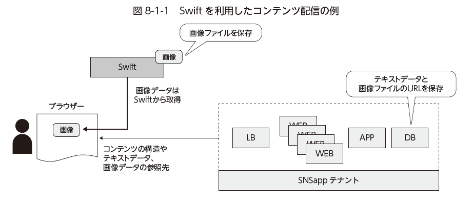
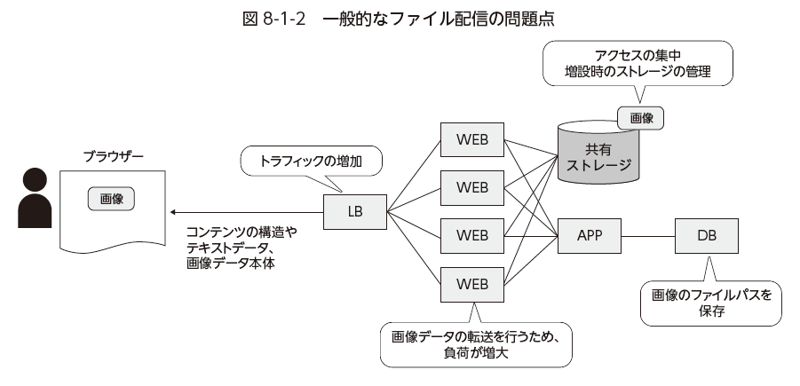

Swiftによるコンテンツ配信
================

----

概要
================

- ここではSwiftを使ったコンテンツ配信について体験します。

----

前提環境
================

- 既に以下の環境が作成されていますので。ブラウザでアクセスしてください。

  - http://15.126.223.219/

----

環境の説明
================

- アクセスした環境は、演習用のサンプルアプリケーションが稼働しています。

  - 画像のアップロード機能を持った掲示板になります。
  - この画像アップロード機能がSwiftと連携しています。

----

Swiftの状態確認
================

- まずSwiftの状態を確認してみます。
- コンソールから演習環境 student *XX* へログインし、以下のコマンドを実行します。

コマンド実行::

  $ source /opt/support/t4-c3/start.sh
  $ swift stat sample_bbs
  $ swift list -l sample_bbs

現在、Swift上に格納されているファイルと状態を確認できます。

  

----

画像のアップロード
================

- ブラウザから画像をアップロードしてみましょう。

  - 画像はWindowsのサンプル画像を利用してください

    - エクスプローラ → ライブラリ → ピクチャ → サンプル

  - アップロード時には何かコメントを入力する必要があります。

----

再度Swiftの確認
================

- 画像のアップロード後に再度Swiftの状態を確認してみます。

コマンド実行::

  $ swift stat sample_bbs
  $ swift list -l sample_bbs

- アップロードした画像が増えていることが確認できるはずです。

----

Swiftへの直接アクセス
================

- ブラウザでアップロードした画像を右クリックし、「リンクのコピー」を行ってください。

  - 以下のような形式になっているはずです。

アドレス例::

  https://region-b.geo-1.objects.hpcloudsvc.com/v1/10841884101289/sample_bbs/2b5b0f98623249048fe4e4feee1c06b4-png

- このアドレスはSwift上の直接のリンクを表しています。

  - 直接ブラウザでアクセスしてみてください。

----

Swiftへの画像アップロードの意味
================

- 今回のサンプルアプリケーションは以下のような構造になっています。

----

Swiftを使うメリット
================

- WEBサーバーを経由せずに、直接コンテンツをユーザーに提供できるため、サーバー負荷を劇的に下げられる
- Swift自身が分散・高可用性を持っているため、通常のストレージをバックエンドに使うよりも、シンプルかつ高信頼な環境を提供できる

----

後かたずけ
================

- 以下のコマンドを実行します。

コマンド実行::

  $ source /opt/support/t4-c3/end.sh

----

ポイントとまとめ
================

- Swiftを使うことで、ストレージからエンドユーザーへ直接コンテンツを提供できるようになります。

- 従来のように、ストレージのボトルネックが発生しないシステムの構築が可能です。

- 既に様々な用途でSwiftは利用されており、コンテンツ配信以外にも大規模メールシステムのバックエンドに採用される例も出てきています。

