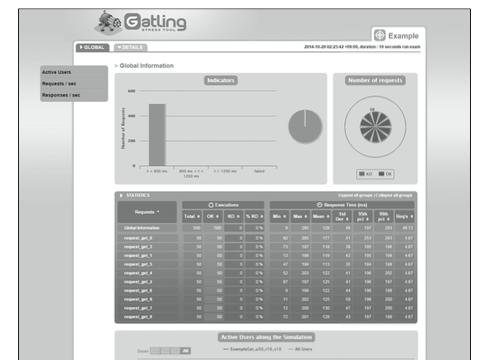

テスト最適化
===========

----

概要
===========

- ここではスケールアウトが容易なクラウド環境に適した負荷計測方法として、Gatlingの使用方法を紹介します。
- Gatlingは並列実効性に優れたOSSの負荷テストツールです。また結果出力もHTMLページで出力されるため見やすく、複数のテストケースを実行するのに役立ちます。

----

操作環境の準備
================

- 下記のコマンドではサンプルアプリケーションの動作する仮想サーバーを起動し、Floating IPを割り当てています。起動には１分から数分かかります。

初期設定実行::

  --- ここから ---

  $ cd /opt/support/t4-c4
  $ ./01_init.sh
  # Creating seurity-group :sg-for-web-student03
  # Booting Server :t4-c4-student03
  --- ここまで ---

----

負荷テスト実行クライアントの起動
================

- 次に負荷テストを実行するためのGatlingをインストールしたサーバーを起動します。

コンソールの様子::

  --- ここから ---
  $ ./02_create_stress.sh 
  # Booting Server :t4-c4-stress-student17
  # Create Floating IP 
  # Associate Floating IP <Floating IP>
  # TESTCLIENT : <Client IP>
  # TESTTARGET : <Target IP>
  --- ここまで ---

----

負荷テストの試行
================

- 負荷テストクライアントにログインし、テストを実行します。

コンソールの様子::

  --- ここから ---
  # ssh -i ~/default.pem root@<Client IP>
  # cd gatling
  # vi paramset.sh 
  (略)
  export GAT_HOST=<Target IP>
  (略)
  # source paramset.sh 
  # sh sample.app.get.sh 
  SampleAppGet_u5_r3_s5 start.
  GATLING_HOME is set to /root/gatling
  (以下略)

  --- ここまで ---

----

負荷テスト結果の確認
================

- テスト結果をブラウザから確認することができます。
- ブラウザで http://<Client IP>/gatling を開き、結果フォルダを開きます。

----

後片付け
===============

- 以下のコマンドを実行し、スナップショットの削除を行ってください。
- 引き続きボリュームのバックアップとリストアに進む場合でも、以下操作を実行してく
ださい。

コマンド実行の様子::

  ---- ここから ----
  # pwd
  /opt/support/t4-c4  # <---「/opt/support/t4-c4」にいることを確認します。
  # ./99_cleanup.sh
  ---- ここまで ----

----

まとめ
================

- Gatlingによる負荷テストの実行を試行しました。テスト結果がグラフ化されて出力されるツールなので、様々な条件でテストを実行するのに向いています。
- 本著ではGatlingを使用してWEB サーバーの負荷限界テストとシステム全体のスループット 向上のためのレスポンスタイム計測を実施しています。クラウドインフラにおいてはリソース使用量の最適化は重要な要件です。このような手法を駆使した最適化をぜひ試してみてください。
